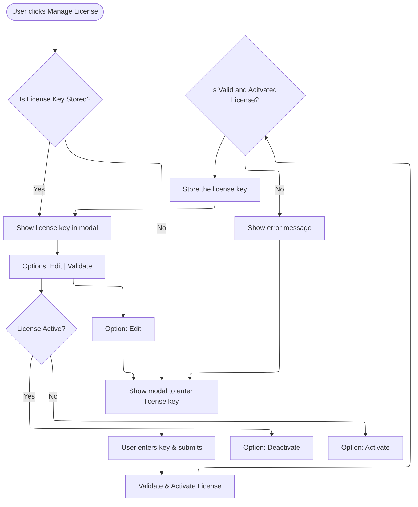

# Manage License Modal Behavior Flow

## Overview
This diagram defines the behavior and flow of the Manage License modal based on whether a license key is already stored for the plugin.

```mermaid
---
config:
  layout: elk
---
flowchart TD
    A(["User clicks Manage License"]) --> B{"Is License Key Stored?"}
    B -- No --> C["Show modal to enter license key"]
    C --> D["User enters key & submits"]
    D --> E["Validate & Activate License"]
    E --> F["Is Valid and Acitvated License?"]
    B -- Yes --> G["Show license key in modal"]
    G --> H["Options: Edit | Validate"]
    H --> I{"License Active?"} & L["Option: Edit"]
    I -- Yes --> J["Option: Deactivate"]
    I -- No --> K["Option: Activate"]
    L --> C
    F -- No --> n1["Show error message"]
    n1 --> C
    F --> n2["Store the license key"]
    n2 --> G
    F@{ shape: diam}


```
