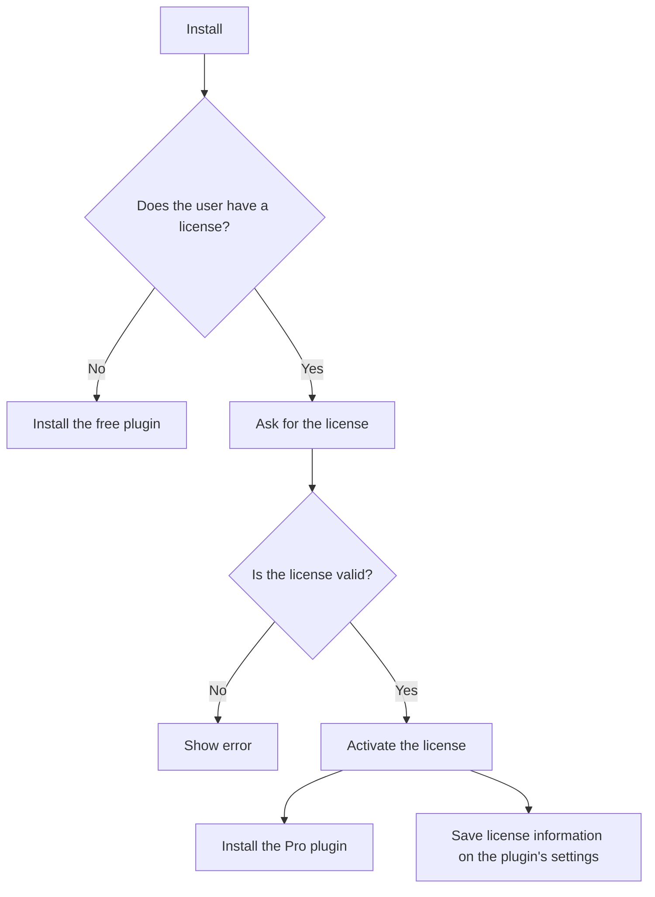

# Plugins Dasboard - Install Plugin

```mermaid
flowchart TD
    A[Install] --> B{Does the user have a license?}
    B -->|No| C[Install the free plugin]
    B -->|Yes| D[Ask for the license]
    D --> E{Is the license valid?}
    E -->|No| F[Show error]
    E -->|Yes| G[Activate the license]
    G --> H[Install the Pro plugin]
    G --> I[Save license information on the plugin's settings]

```

